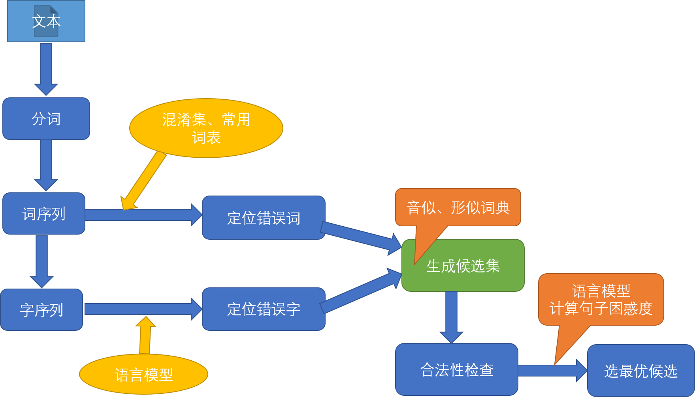

# 输入法中的中文文本纠错及拼音切分
### pycorrector中的纠错技术流程


## 问题分析
中文文本纠错任务，常见错误类型包括：
- 谐音字词，如 配副眼睛-配副眼镜
- 混淆音字词，如 流浪织女-牛郎织女
- 字词顺序颠倒，如 伍迪艾伦-艾伦伍迪
- 字词补全，如 爱有天意-假如爱有天意
- 形似字错误，如 高梁-高粱
- 中文拼音全拼，如 xingfu-幸福
- 中文拼音缩写，如 sz-深圳
- 语法错误，如 想象难以-难以想象
## 解决方案
- 中文纠错分为两步走，第一步是错误检测，第二步是错误纠正；
- 错误检测部分先通过结巴中文分词器切词，由于句子中含有错别字，所以切词结果往往会有切分错误的情况，这样从字粒度和词粒度两方面检测错误， 整合这两种粒度的疑似错误结果，形成疑似错误位置候选集；
- 错误纠正部分，是遍历所有的疑似错误位置，并使用音似、形似词典替换错误位置的词，然后通过语言模型计算句子困惑度，对所有候选集结果比较并排序，得到最优纠正词。
## 错误检测
- 字粒度：语言模型困惑度（ppl）检测某字的似然概率值低于句子文本平均值，则判定该字是疑似错别字的概率大。
- 词粒度：切词后不在常用词典中的词是疑似错词的概率大。切词后在混淆词典中的词疑似错词概率大。
## 错误纠正
- 通过错误检测定位所有疑似错误后，取所有疑似错字的音似、形似候选词。
- 在混淆集中的错误词，直接用混淆集替换
- 使用候选词替换，基于语言模型得到类似翻译模型的候选排序结果，得到最优纠正词。
## 安装运行
### 安装
```
git clone https://github.com/cabbageNoob/input_corrector.git
git checkout -b query_corrector origin/query_corrector      #切换到query_corrector分支
```
直接运行search_server目录下的manager.py文件，控制台会提示需要安装的模块，根据提示安装即可
### 注意kenlm的安装
#### windows
```
pip install -e git+https://github.com/kpu/kenlm.git#egg=kenlm
```
#### linux
在官网下载 http://kheafield.com/code/kenlm.tar.gz，解压
```
cd kenlm
mkdir build
cd build
cmake ..
make
python setup.py install
```
运行成功后，向127.0.0.1:8001/get_maybe_sentence路由传递待纠错文本，可获得5个最可能的纠错结果
```
(pytorch-gpu) D:\LMModel\pycorrector_git>curl 127.0.0.1:8001/get_maybe_sentence -X post -F "sentence"="beijing理工大学"
 {"pred_sentences": [{"score": -48.49791717529297, "sentence": "\u5317\u4eac\ufffd\ufffd\ufffd\ufffd\ufffd\ufffd\u0467"}, {"score": -49.989501953125, "sentence": "\u80cc\u666f\ufffd\ufffd\ufffd\ufffd\ufffd\ufffd\u0467"}, {"score": -52.382991790771484, "sentence": "\u80cc\u4e95\ufffd\ufffd\ufffd\ufffd\ufffd\ufffd\u0467"}, {"score": -52.43653106689453, "sentence": "\u88ab\u60ca\ufffd\ufffd\ufffd\ufffd\ufffd\ufffd\u0467"}, {"score": -53.264644622802734, "sentence": "\u5907\u4e95\ufffd\ufffd\ufffd\ufffd\ufffd\ufffd\u0467"}]}
 ```
